## Overview

This tutorial demonstrates a platform engineering approach to DataPower
development and deployment. It demonstrates continuous integration, continuous
deployment, GitOps, Infrastructure as Code and DevOps using containers,
Kubernetes and a set of popular cloud native tools such as ArgoCD and Tekton.

In this tutorial, you will:

1. Create a Kubernetes cluster and image registry, if required.
2. Create an operational repository to store DataPower resources that are
   deployed to the Kubernetes cluster.
3. Install ArgoCD to manage the continuous deployment of DataPower-related
   resources to the cluster.
4. Create a source Git repository that holds the DataPower development artifacts
   for a virtual DataPower appliance.
5. Install Tekton to provide continuous integration of the source DataPower
   artifacts. These pipeline ensures that all changes to these artifacts are
   successful built, packaged, versioned and tested before they are delivered
   into the operational repository, read for deployment.
6. Gain experience with the IBM-supplied DataPower operator and container.

By the end of the tutorial, you will have practical experience and knowledge of
platform engineering with DataPower in a Kubernetes environment.

---

## Introduction

The following diagram shows a CICD pipeline for DataPower:

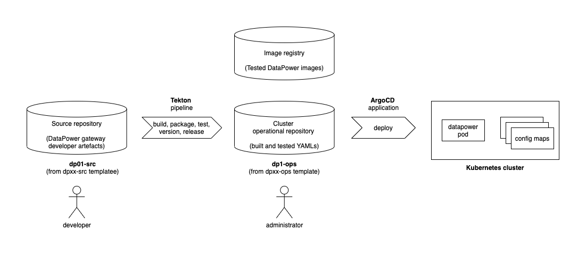

Notice:

- The git repository `dp01-src` holds the source development artifacts for a
  virtual DataPower appliance `dp01`.
- A Tekton pipeline uses the `dp01-src` repository to build, package, test,
  version and deliver resources that define the `dp01` DataPower appliance.
- If the pipeline is successful, then the YAMLs that define `dp01` are stored in
  the operational repository `dp01-ops` and the container image for `dp01` is
  stored in an image registry.
- Shortly after the changes are committed to the git repository, an ArgoCD
  application detects the updated YAMLs. It applies them to the cluster to create or
  update a running `dp01` DataPower virtual appliance.

This tutorial will walk you through the process of setting up this
configuration:
- Step 1: Follow the instructions in this README to set up your cluster, ArgoCD,
  the `dp01-ops` repository, and Tekton. Continue to step 2.
- Step 2: Move to [these
  instructions](https://github.com/dp-auto/dpxx-src#readme) to create the
  `dp01-src` repository, run a Tekton pipeline to populate the `dp01-ops`
  repository, and interact with the new or updated DataPower appliance `dp01`.

---

## Install Kubernetes

At the moment, this Tutorial requires OpenShift. It will be updated to support
Minikube.

---

## Login to the cluster

From the your OpenShift web console console, select `Copy login command`, and
copy the login command.

Login to cluster using this command, for example:

```bash
oc login --token=sha256~noTAVal1dSHA --server=https://example.cloud.com:31428
```

which should return a response like this:

```bash
Logged into "https://example.cloud.com:31428" as "odowda@example.com" using the token provided.

You have access to 67 projects, the list has been suppressed. You can list all projects with 'oc projects'

Using project "default".
```

indicating that you are now logged into the Kubernetes cluster.

---

## Create a GitHub organization for your repositories

This tutorial requires you to create the `dp01-src` and `dp01-ops` repositories.
It's a good idea to create them in a separate organization because it makes it
easy to collaborate with your colleagues later on.

<br>

Click on the following URL: [https://github.com/settings/organizations](https://github.com/settings/organizations)
to create a new organization:


<br> You will see a list of your existing GitHub organizations:

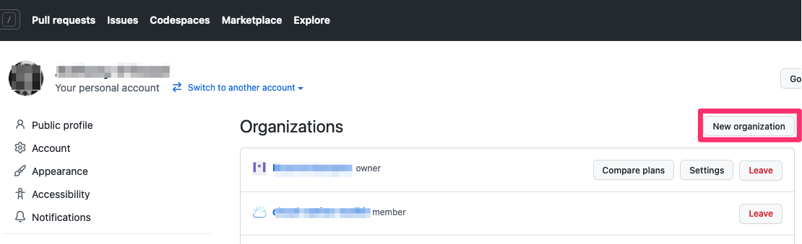

You're going to create a new organization for this tutorial.

<br> Click on `New organization`:

<br> This shows you the list of available plans:

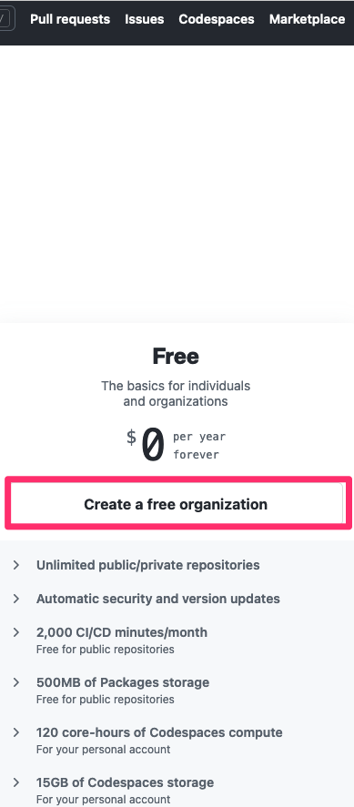

The `Free` plan is sufficient for this tutorial.

<br> Click on `Create a free organization`:

<br> This shows you the properties for the new organization.

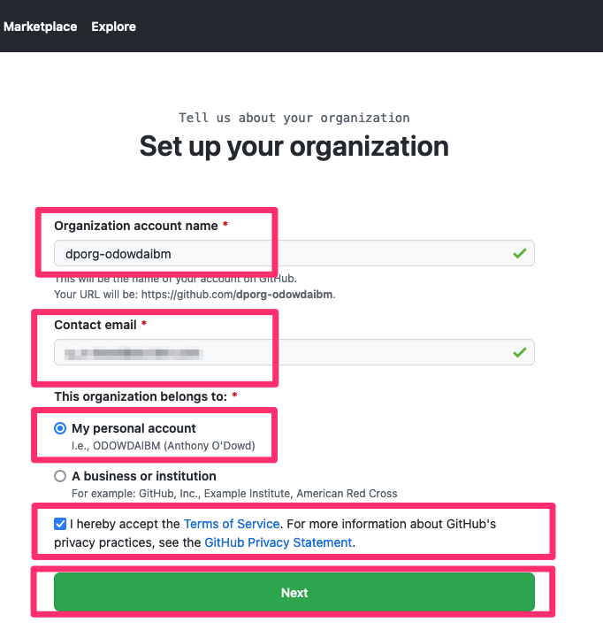

<br> Complete the details for your new organization.

* Specify `Organization account name` of the form `dporg-xxxxx` where `xxxxx` is
  your GitHub user name.
* Specify `Contact mail` e.g. `odowda@example.com`
* Select `My personal account`.

<br> Once you've complete this page, click `Next`:

<br> Your new organization `dporg-xxxxx` has now been created:
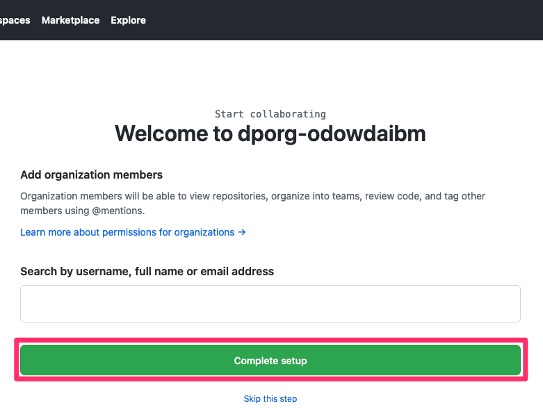

You can add colleagues to this organization each with a particular role. For
now, we can use the organization as-is.

<br> Click on `Complete setup` to complete the organization creation process.

<br> Although you may see a few more screens, such as a usage survey, your
organization has been now been created. We will use it to host the `dp01-src`
and `dp01-ops` repositories in this tutorial.

---

##  Useful environment variables

We now define some environment variables that are used by the commands in this
tutorial to make them easy to use.

Define your GitHub organization name in the `GITORG` variable using the name you
supplied above, e.g. `dporg-xxxxx`.

Open a new Terminal window and type:

```bash
export GITORG=dporg-odowdaibm
```

Let's use this environment variable to examine your new organization in GitHub.

Enter the following command:

```bash
echo https://github.com/orgs/$GITORG/repositories
```

which will respond with a URL of this form:

```bash
https://github.com/orgs/dporg-odowdaibm/repositories
```

Navigate to this URL in your browser:

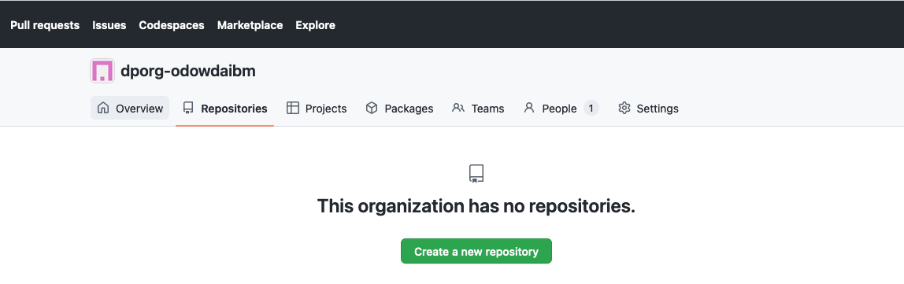

You can see that your new organization doesn't yet have any repositories in it.
Let's start by adding the `dp01-ops` repository to it.

---

## Creating the `dp01-ops` repository

We use a [template repository](https://github.com/dp-auto/dpxx-ops) to
create `dp01-ops` in our new organization. Forking a template creates a
repository with a clean git history, allowing us to track the history of changes
to our cluster every time we update `dp01-ops`.

<br> Click on [this URL](https://github.com/dp-auto/dpxx-ops/generate) to fork from
the `dpxx-ops` template repository:

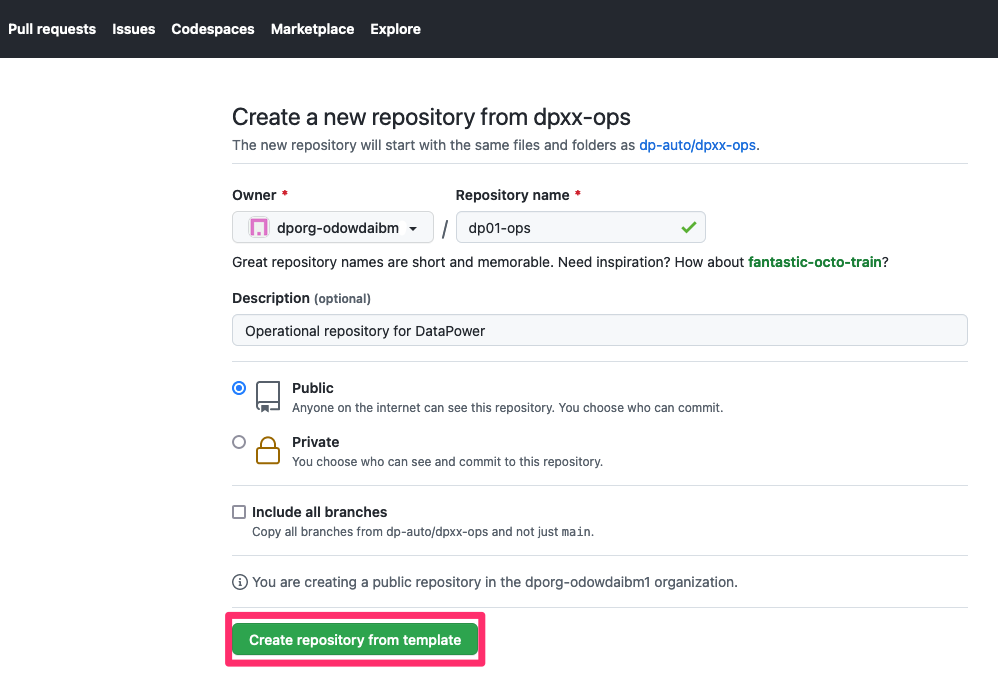

This screen allows you to define the properties for you copy of the `dp01-src`
repository.

Specifically:

* In the `Repository name` field, specify `dp01-ops`.
* In the `Description` field, specify `Operational repository for DataPower`.
* Select `Public` for the repository visibility.

<br> Click on `Create repository from template`:

<br> This repository will be cloned to the specified GitHub account:
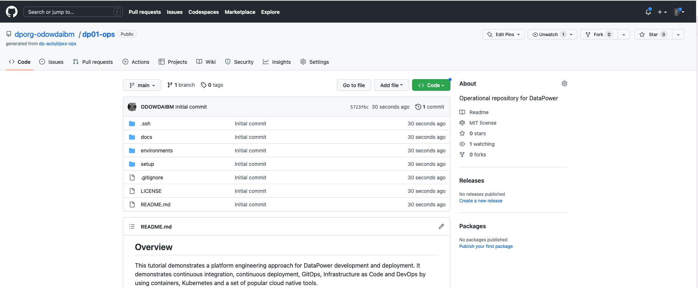

<br> You have successfully created a copy of the `dp01-ops` repository in your
organization.

---

## Clone repository to your local machine

We're going to use the contents of this repository to configure our cluster. To
do this we need to clone this repository to our local machine.

It's best practice to store cloned git repositories under a folder called `git`,
with subfolders that correspond to your projects.

Issue the following commands to create this folder structure and clone the
`dp01-ops` repository from GitHub to your local machine.

```bash
mkdir -p $HOME/git/$GITORG-tutorial
cd $HOME/git/$GITORG-tutorial
git clone git@github.com:$GITORG/dp01-ops.git
```

---

## Create DataPower development namespace

Let's use some YAML in `dp01-ops` to define two namespaces in our cluster:

Issue the following command:

```bash
oc apply -f setup/namespaces.yaml
```

which will confirm the following namespaces are created in the cluster:

```bash
namespace/dp01-ci created
namespace/dp01-dev created
```

As the tutorial proceeds, we'll see how the YAMLs in `dp01-ops` **fully** define
the DataPower related resources deployed to the cluster. In fact, we're going to
set up the cluster such it is **automatically** updated whenever the `dp01-ops`
repository is updated. This concept is called **continuous deployment** and we'll
use ArgoCD to achieve it.

---

## Explore the `dp01-ops` repository

If you'd like to understand a little bit more about how the namespaces were
created, you can explore the contents of the `dp01-ops` repository.

Issue the following command:

```bash
cd dp01-ops
cat setup/namespaces.yaml
```

which shows the following namespace definitions:

```yaml
kind: Namespace
apiVersion: v1
metadata:
  name: dp01-ci
  labels:
    name: dp01-ci
---
kind: Namespace
apiVersion: v1
metadata:
  name: dp01-dev
  labels:
    name: dp01-dev
```

Issue the following command to show these namespaces in the cluster

```bash
oc get namespace dp01-ci
oc get namespace dp01-dev
```

which will shows these namespaces and their age, for example:

```bash
NAME      STATUS   AGE
dp01-ci   Active   27d
NAME       STATUS   AGE
dp01-dev   Active   35d
```

During this tutorial, we'll see how:

- the `dp01-ci` namespace is used to store specific Kubernetes resources to
  build, package, version and test `dp01`.
- the `dp01-dev` namespace is used to store specific Kubernetes resources
  relating to a running DataPower virtual appliance, `dp01`.

---

## Create ArgoCD subscription

Let's install ArgoCD to enable continuous deployment.

Use the following command to create a subscription for ArgoCD:

```bash
oc apply -f setup/argocd-operator-sub.yaml
```

which will create a subscription for ArgoCD:

```bash
subscription.operators.coreos.com/openshift-gitops-operator created
```

Explore the subscription using the following command:

```bash
cat setup/argocd-operator-sub.yaml
```

which details the subscription:

```yaml
apiVersion: operators.coreos.com/v1alpha1
kind: Subscription
metadata:
  name: openshift-gitops-operator
  namespace: openshift-operators
spec:
  channel: stable
  installPlanApproval: Manual
  name: openshift-gitops-operator
  source: redhat-operators
  sourceNamespace: openshift-marketplace
```

See if you can understand each YAML node, referring to
[subscriptions](https://olm.operatorframework.io/docs/concepts/crds/subscription/)
if you need to learn more.

## Approve ArgoCD install plan

This subscription enables the cluster to keep up-to-date with new releases of
ArgoCD. Each release has an [install
plan](https://olm.operatorframework.io/docs/concepts/olm-architecture/) that is
used to maintain it. Our install plan requires manual approval; we'll see why a
little later.

Let's find our install plan and approve it.

Issue the following command:

```bash
oc get installplan -n openshift-operators | grep "openshift-gitops-operator" | awk '{print $1}' | \
xargs oc patch installplan \
 --namespace openshift-operators \
 --type merge \
 --patch '{"spec":{"approved":true}}'
```

which will approve the install plan `install-xxxxx` for ArgoCD.

```bash
installplan.operators.coreos.com/install-xxxxx patched
```

ArgoCD will now install; this may take a few minutes.

## Verify ArgoCD installation

A
[ClusterServiceVersion](https://olm.operatorframework.io/docs/concepts/crds/clusterserviceversion/)
(CSV) is created for each release of the ArgoCD operator installed in the
cluster.  it holds the dependent images used by the operator.

We can verify that the installation has completed successfully by examining the
CSV for ArgoCD.

Issue the following command:

```bash
oc get clusterserviceversion openshift-gitops-operator.v1.5.7 -n openshift-gitops
```

```bash
NAME                               DISPLAY                    VERSION   REPLACES                                          PHASE
openshift-gitops-operator.v1.5.7   Red Hat OpenShift GitOps   1.5.7     openshift-gitops-operator.v1.5.6-0.1664915551.p   Succeeded
```

See how the operator has been successfully installed at version 1.5.7.

Feel free to explore this CSV:

```bash
oc describe csv openshift-gitops-operator.v1.5.7 -n openshift-operators
```

The output provides an extensive amount of information is provided not listed
here; feel free to examine it.

## Minor modifications to ArgoCD

ArgoCD will deploy `dp01` and its related resources to the cluster. These
resources are labelled by ArgoCD with a specific `applicationInstanceLabelKey`
so that they can be tracked for configuration drift. The default label used by ArgoCD collides with DataPower operator, so we need to change it.

Issue the following command to change the `applicationInstanceLabelKey`used by
ArgoCD:

```bash
oc patch argocd openshift-gitops  \
 --namespace openshift-gitops \
 --type merge \
 --patch '{"spec":{"applicationInstanceLabelKey":"argocd.argoproj.io/instance"}}'
```

which should respond with:

```bash
argocd.argoproj.io/openshift-gitops patched
```

which confirms that the ArgoCD operator has been patched and will now add this
label to every resource it deploys to the cluster.

---

## Role and role binding

ArgoCD requires permission to create resources in the `dp01-dev` namespace. We
use a role to define the resources required to deploy a DataPower virtual
appliance, and a role binding to associate this role with the `serviceaccount`
associated with ArgoCD.

Issue the following command to create this `role`:

```bash
oc apply -f setup/dp-role.yaml
```

which confirms that the `dp-deployer` role has been created:

```bash
role.rbac.authorization.k8s.io/dp-deployer created
```

Issue the following command to create the corresponding `rolebinding`:

```bash
oc apply -f setup/dp-rolebinding.yaml
```

which confirms that the `dp-deployer` role binding  has been created:

```bash
rolebinding.rbac.authorization.k8s.io/dp-deployer
```

We can see which resources ArgoCD can now create in the cluster by examining the
`dp-deployer` role:

```bash
oc describe role dp-deployer -n dp01-dev
```

which returns:

```bash
Name:         dp-deployer
Labels:       <none>
Annotations:  <none>
PolicyRule:
  Resources                            Non-Resource URLs  Resource Names  Verbs
  ---------                            -----------------  --------------  -----
  secrets                              []                 []              [*]
  services                             []                 []              [*]
  datapowerservices.datapower.ibm.com  []                 []              [*]
  ingresses.networking.k8s.io          []                 []              [*]
```

See how ArgoCD can now control `secrets`, `services`, `datapowerservices` and
`ingresses` with all operations such as create, read, update and delete (i.e.
`Verbs[*]`).

---

## Add IBM catalog sources

Like ArgoCD, there is a dedicated operator that manages DataPower virtual appliances in
the cluster. Unlike ArgoCD, its definition is held in the IBM [catalog
source](https://olm.operatorframework.io/docs/concepts/crds/catalogsource/), so
we need to add this catalog source to the cluster before we can install it.

Issue the following command:

```bash
oc apply -f setup/catalog-sources.yaml
```

which will add the catalog sources defined in this YAML to the cluster:

```bash
catalogsource.operators.coreos.com/opencloud-operators created
catalogsource.operators.coreos.com/ibm-operator-catalog created
```

Notice, that there actually **two** new catalog sources added; feel free to
examine the catalog source YAML:

```bash
cat setup/catalog-sources.yaml
```

which shows you the detailed YAML for these catalog sources:

```bash
apiVersion: operators.coreos.com/v1alpha1
kind: CatalogSource
metadata:
  name: opencloud-operators
  namespace: openshift-marketplace
spec:
  displayName: IBMCS Operators
  publisher: IBM
  sourceType: grpc
  image: docker.io/ibmcom/ibm-common-service-catalog:latest
  updateStrategy:
    registryPoll:
      interval: 45m
---
apiVersion: operators.coreos.com/v1alpha1
kind: CatalogSource
metadata:
  name: ibm-operator-catalog
  namespace: openshift-marketplace
spec:
  displayName: IBM Operator Catalog
  image: 'icr.io/cpopen/ibm-operator-catalog:latest'
  publisher: IBM
  sourceType: grpc
  updateStrategy:
    registryPoll:
      interval: 45m
```

Examine these YAMLs to see if you can understand [how they
work](https://olm.operatorframework.io/docs/concepts/crds/catalogsource/).

---

## Install DataPower operator

We can now install the DataPower operator; using the same process as we used with ArgoCD.

Issue the following command:

```bash
oc apply -f setup/dp-operator-sub.yaml
```

which will create the DataPower operator subscription:

```bash
subscription.operators.coreos.com/datapower-operator created
```

Explore the subscription using the following command:

```bash
cat setup/dp-operator-sub.yaml
```

which details the subscription:

```yaml
apiVersion: operators.coreos.com/v1alpha1
kind: Subscription
metadata:
  labels:
    operators.coreos.com/datapower-operator.dp01-ns: ''
  name: datapower-operator
  namespace: openshift-operators
spec:
  channel: v1.6
  installPlanApproval: Manual
  name: datapower-operator
  source: ibm-operator-catalog
  sourceNamespace: openshift-marketplace
  startingCSV: datapower-operator.v1.6.3
```

Notice how this operator is installed in the `openshift-operators` namespace.
Note also the use of `channel` and `startingCSV` to be precise about the exact
version of the DataPower operator to be installed.

## Approve and verify DataPower install plan

Let's find our DataPower install plan and approve it.

```bash
oc get installplan -n openshift-operators | grep "datapower-operator" | awk '{print $1}' | \
xargs oc patch installplan \
 --namespace openshift-operators \
 --type merge \
 --patch '{"spec":{"approved":true}}'
```

which will approve the install plan:

```bash
installplan.operators.coreos.com/install-xxxxx patched
```

where `install-xxxxx` is the name of the DataPower install plan.

Again, feel free to verify the DataPower installation with the following
commands:

```bash
oc get clusterserviceversion datapower-operator.v1.6.4 -n openshift-operators
```

```bash
NAME                                     DISPLAY                       VERSION   REPLACES                                          PHASE
datapower-operator.v1.6.4                IBM DataPower Gateway         1.6.4     datapower-operator.v1.6.3                         Succeeded
```

which shows that the 1.6.4 version of the operator has been successfully installed.

```bash
oc describe csv datapower-operator.v1.6.4 -n openshift-operators
```

The output provides an extensive amount of information is provided not listed
here; feel free to examine it.

---

## Install Tekton pipelines

Our final task is to install Tekton.  With it, we can create pipelines that
populate the operational repository `dp01-ops` using the DataPower configuration
and development artifacts stored in `dp01-src`. Once populated by Tekton, ArgoCD
will then synchronize these artifacts with the cluster to ensure the cluster is
running the most up-to-date version of `dp01`.

Issue the following command to create a subscription for Tekton:

```bash
oc apply -f setup/tekton-operator-sub.yaml
```

which will create a subscription:

```bash
subscription.operators.coreos.com/openshift-pipelines-operator created
```

Again, this subscription enables the cluster to keep up-to-date with new version
of Tekton.

Explore the subscription using the following command:

```bash
cat setup/tekton-operator-sub.yaml
```

which details the subscription:

```yaml
apiVersion: operators.coreos.com/v1alpha1
kind: Subscription
metadata:
  name: openshift-pipelines-operator
  namespace: openshift-operators
spec:
  channel:  stable
  installPlanApproval: Manual
  name: openshift-pipelines-operator-rh
  source: redhat-operators
  sourceNamespace: openshift-marketplace
```

Manual Tekton install:
```bash
kubectl apply -f https://storage.googleapis.com/tekton-releases/pipeline/previous/v0.16.3/release.yaml)
```
---

## Approve and verify Tekton install plan

Let's find our install plan and approve it.

```bash
oc get installplan -n openshift-operators | grep "openshift-pipelines-operator" | awk '{print $1}' | \
xargs oc patch installplan \
 --namespace openshift-operators \
 --type merge \
 --patch '{"spec":{"approved":true}}'
```

which will approve the install plan

```bash
installplan.operators.coreos.com/install-xxxxx patched
```

where `install-xxxxx` is the name of the Tekton install plan.

Again, feel free to verify the Tekton installation with the following commands:

```bash
oc get clusterserviceversion -n openshift-pipelines
```

(replacing `x.y.z` with the installed version of Tekton)

```bash
oc describe csv openshift-pipelines-operator-rh.vx.y.z -n openshift-operators
```

---

## Generate ssh keys for GitHub access

To allow Tekton to access GitHub, specifically to create YAMLs in the `dp01-ops`
repository, we need to set up appropriate SSH keys for access.

Issue the following command to create an SSH key pair:

```bash
ssh-keygen -t rsa -b 4096 -C "your_email@example.com" -f ./.ssh/id_rsa -q -N ""
```

Issue the following command to create a `known_hosts` file for SSH access:

```bash
ssh-keyscan -t rsa github.com | tee ./.ssh/github-key-temp | cat ./.ssh/github-key-temp >> ./.ssh/known_hosts
```

Issue the following command to create a secret containing the  SSH private key
and `known_hosts` file:

```bash
oc create secret generic dp01-ssh-credentials -n dp01-ci --from-file=id_rsa=./.ssh/id_rsa --from-file=known_hosts=./.ssh/known_hosts --from-file=./.ssh/config --dry-run=client -o yaml > .ssh/dp-git-credentials.yaml
```

Issue the following command to create this secret in the cluster:

```bash
oc apply -f .ssh/dp-git-credentials.yaml
```

Finally, add this secret to the `pipeline` service account to allow it to use
`dp-1-ssh-credentials` secret to access GitHub.

```bash
oc patch serviceaccount pipeline \
    --namespace dp01-dev \
    --type merge \
    --patch '{"secrets":[{"name":"dp01-ssh-credentials"}]}'
```

---

## Copy ssh credential into Github

To allow the Tekton pipeline to push the generated DataPower Kubernetes resource
YAMLs to the `dp01-ops` repository, we need to add the public key we've just
generated to GitHub.

Use the following link in a browser to access the GitHub user interface to add
an SSH public key:

```bash
https://github.com/settings/keys
```

You'll see the following page:

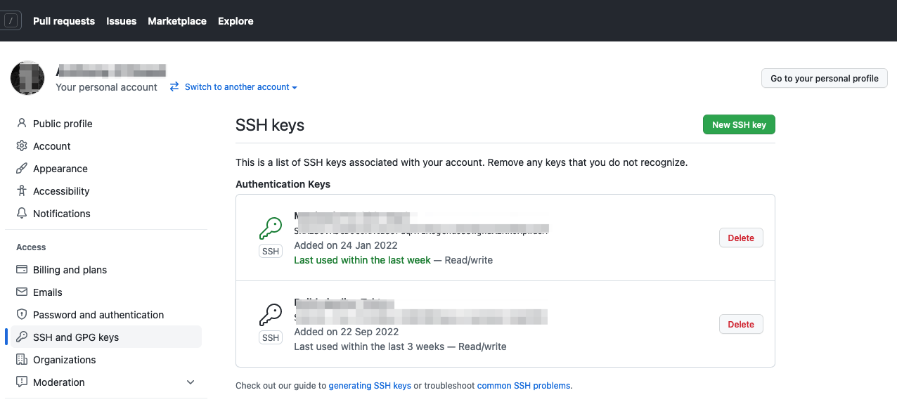

Copy your public key to the clipboard:

```bash
pbcopy < ./.ssh/id_rsa.pub
```

Click on `New SSH Key`, and complete the following details:

* Add name `dp01 SSH key`
* Paste key into box

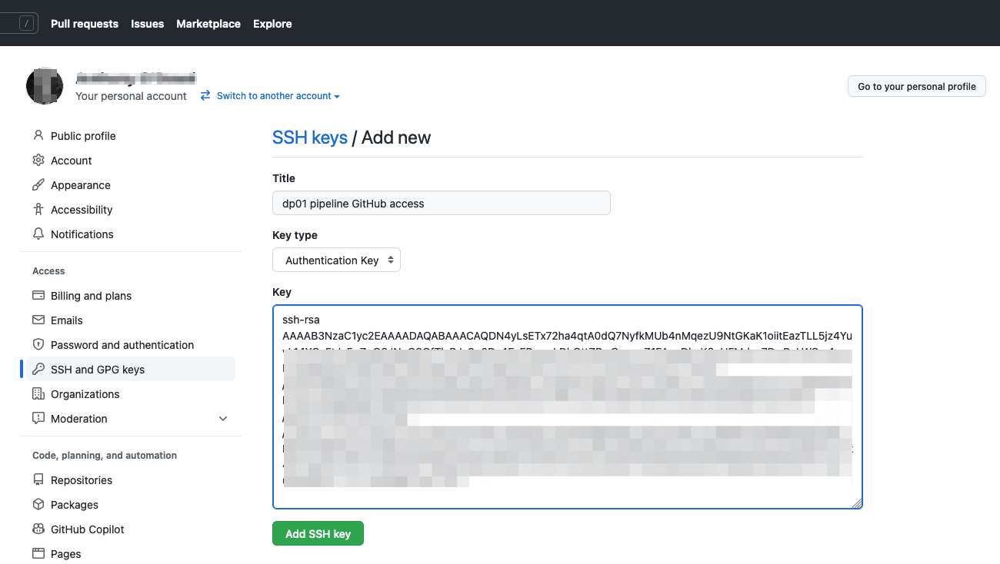

* Hit `Add SSH key` button

The Tekton pipeline now has access to your GitHub.

*(Might be better to use access tokens, to limit scope... consider as change.)*

---

## An ArgoCD application to manage `dp01`

Finally, we're going to create an ArgoCD application to manage `dp01`.

```bash
cat environments/dev/argocd/dp01.yaml
```

```yaml
apiVersion: argoproj.io/v1alpha1
kind: Application
metadata:
  name: dp01-argo
  namespace: openshift-gitops
  annotations:
    argocd.argoproj.io/sync-wave: "100"
  finalizers:
    - resources-finalizer.argocd.argoproj.io
spec:
  destination:
    namespace: dp01-dev
    server: https://kubernetes.default.svc
  project: default
  source:
    path: environments/dev/dp01/
    repoURL: https://github.com/dp-auto/dp01-ops.git
    targetRevision: main
  syncPolicy:
    automated:
      prune: true
      selfHeal: true
    syncOptions:
      - Replace=true
```

In your GitHub repository, replace `dp-auto` with your Git user id and deploy it
to the cluster: (**Add push commands**)

Notice how the this Argo application will be monitoring GitHub for resources to
deploy to the cluster:

```yaml
  source:
    path: environments/dev/dp01/
    repoURL: https://github.com/odowdaibm/dp01-ops.git
    targetRevision: main
```

See how:
  - `repoURL: https://github.com/odowdaibm/dp01-ops.git` identifies the
    repository where the YAMLs are located
  - `targetRevision: main` identifies the branch within the repository
  - `path: environments/dev/dp01/` identifies the folder within the repository

## Deploy `dp01-argo` to the cluster

Let's deploy this ArgoCD application to the cluster:

```bash
oc apply -f environments/dev/argocd/dp01.yaml
```

which will complete with:

```bash
application.argoproj.io/dp01-argo created
```

We now have an ArgoCD application monitoring our repository.

## View `dp01-argo` in ArgoCD UI

We can use the ArgoCD UI to look at the `dp01-argo` application and the
resources it is managing:

Issue the following command to identify the URL for the ArgoCD login page:

```bash
oc get route openshift-gitops-server -n openshift-gitops -o jsonpath='{"https://"}{.spec.host}{"\n"}'
```

which will return a URL similar to this:

```bash
https://openshift-gitops-server-openshift-gitops.vpc-mq-cluster1-d02cf90349a0fe46c9804e3ab1fe2643-0000.eu-gb.containers.appdomain.cloud
```

Issue the following command to determine the ArgoCD `password` for the `admin`
user:

```bash
oc extract secret/openshift-gitops-cluster -n openshift-gitops --keys="admin.password" --to=-
```

Login to ArgoCD with `admin` and `password`.

You will see the following screen:

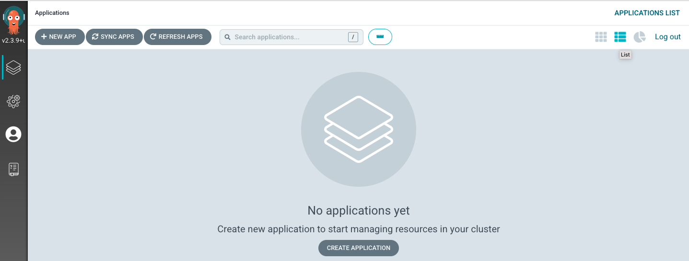

The ArgoCD application `dp01-argo` is monitoring the
`https://github.com/ODOWDAIBM/dp01-ops` repository.

We will now run the Tekton pipeline to populate this repository.

---

## Congratulations

You've set up your cluster for DataPower.  Let's run a pipeline to populate the
repository.

Continue [here](https://github.com/dp-auto/dpxx-src#readme):

---

